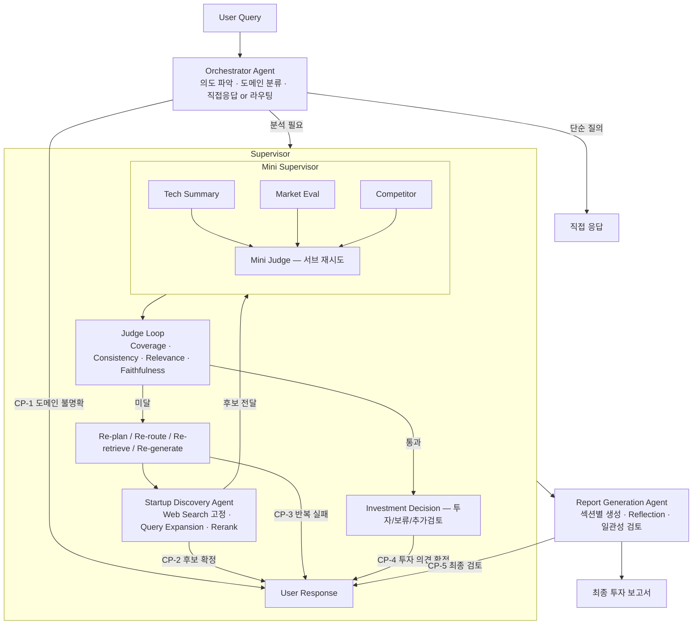

# 시스템 설계서 — 반도체 스타트업 투자 분석 멀티 에이전트 시스템

> Supervisor-SubAgent · HITL · Tool Router · GraphState · 3-Layer Storage

---

## 0. 시스템 개요

본 시스템은 반도체 도메인의 기술력과 시장성을 평가하기 위해 Supervisor-SubAgent 구조를 채택합니다.
데이터 품질 보장과 효율적 리소스 사용을 위해 HITL, 지능형 Tool Router, 3단 스토리지 전략을 포함합니다.

**핵심 구성 요소**

- Orchestrator Agent — 진입점. 직접응답 vs 파이프라인 분기 판단, 도메인 분류
- Supervisor — 작업 분배 · Judge Loop · Investment Decision · HITL 중재
- Mini Supervisor — Discovery 이후 3개 에이전트 병렬 관리 + 서브 Judge
- Worker Agents (5개) — Discovery / Tech Summary / Market / Competitor / Report
- HITL 체크포인트 (5개) — CP-1 ~ CP-5
- Tool Router — 에이전트별 데이터 소스 접근 전략
- 3단 스토리지 — GraphState (경량) · Vector DB (임베딩) · S3 (원문)

---

## 1. 전체 시스템 흐름

### 1.1 Orchestrator Agent

모든 사용자 질의의 진입점입니다. Domain Router 없이 직접 두 가지 역할을 수행합니다.

- **직접응답 판단** — 단순 질의("반도체가 뭐야?")는 LLM이 즉시 응답하고 파이프라인을 거치지 않습니다.
- **도메인 분류** — AI칩, 전력 반도체, 설계/Fabless 등 세부 도메인을 판단하여 `detected_domain` · `target_domain`을 설정합니다.
- **CP-1 발동** — 도메인 확정 불가 시 사람에게 확인을 요청합니다.

### 1.2 Query Rewriting 2단계 구조

쿼리 재작성은 두 단계에서 독립적으로 일어납니다.

| 단계 | 수행 주체 | 내용 |
|---|---|---|
| 1단계 | Supervisor | 사용자 의도 파악 · target_domain 정제 · question 정규화 |
| 2단계 | 각 에이전트 | 자기 역할에 맞는 검색 쿼리 독립 생성 — 에이전트마다 다름 |

**에이전트별 쿼리 예시** (질의: "반도체 스타트업 투자 보고서 써줘")

- Discovery: `"2025 2026 AI반도체 팹리스 스타트업 투자유치 트렌드"`
- Tech Summary: `"DEEPX NPU 아키텍처 특허 TRL 기술스택"`
- Market: `"AI 반도체 TAM SAM 2025 성장률 CAGR"`
- Competitor: `"인피니언 온세미 SiC 시장점유율 투자액"`

### 1.3 실행 Phase

```
Phase 1 — Sequential: Startup Discovery Agent
  startup_candidates 확보 최우선.
  완료 후 CP-2 HITL 발동.

Phase 2 — Parallel: Mini Supervisor
  Tech Summary · Market Evaluation · Competitor 병렬 실행.
  서브 Judge: 에이전트 내부에서만 재시도 (Supervisor 전체 루프 불필요).

Phase 3 — Supervisor Judge Loop → Investment Decision → Report Generation
```

---

## 2. HITL (Human-In-The-Loop) 체크포인트

분석 정확도 향상과 AI 탈선 방지를 위해 총 5개의 개입 시점을 운영합니다.

| ID | 체크포인트 | 발동 조건 | 유형 | 상세 내용 |
|---|---|---|---|---|
| CP-1 | 도메인 불명확 | Orchestrator가 target_domain 확정 불가 | Blocking | 확인 전까지 다음 단계 진행 불가 |
| CP-2 | 스타트업 후보 확정 | Discovery Agent 후보 추출 직후 | Blocking | 후보 선택, 제외, 재탐색 중 하나 지시 |
| CP-3 | Judge 반복 실패 | iteration_count >= 2 이며 점수 미달 | Blocking | 자동 재시도 실패 시 사람이 직접 방향 수정 |
| CP-4 | 투자 의견 확정 | Investment Decision 직후 | Optional | AI 제안 의견(투자/보류/추가검토) 최종 동의 |
| CP-5 | 보고서 최종 검토 | Report Agent 생성 직후 | Optional | 수정 요청 반영 또는 최종 출력 승인 |

---

## 3. 에이전트별 지능형 Tool Router

### 3.1 전략 요약

| 에이전트 | 전략 | 상세 |
|---|---|---|
| Startup Discovery | Web Search 전용 | 항상 web_search 고정. Vector DB 불필요 |
| Tech Summary | Memory-First Hybrid | Vector DB 우선 → 미달 시 web_search 추가 |
| Market Evaluation | Always Multi-hop | Vector DB + web_search 항상 병행. 최신 수치 필수 |
| Competitor | Memory-First Hybrid | Vector DB 우선 → 미달 시 web_search 추가 |
| Report Generation | No Tool | GraphState 검증 데이터만 참조. 외부 호출 없음 |

### 3.2 캐시 HIT 판단 기준 (Tech Summary · Competitor)

```
캐시 HIT 조건 — 두 조건 모두 충족 시 web_search 스킵
  유사도 스코어 >= 0.85
  관련 청크 수   >= 3개

캐시 MISS 시 처리
  web_search 추가 실행
  → Vector DB 결과와 병합
  → Vector DB 업데이트 (다음 호출을 위한 캐시 갱신)
```

### 3.3 GraphState 캐시 우선순위

1. **GraphState** `tech_summaries` / `competitor_profiles` 조회 (가장 빠름, 동일 스타트업 재분석 방지)
2. **Vector DB** 유사도 검색 (관련 청크 있으면 재요약만 수행)
3. **web_search** 실행 (1·2순위 모두 미달일 때만)

---

## 4. 3단 스토리지 전략

GraphState에 문서 전문을 저장하면 LLM 컨텍스트 윈도우가 초과됩니다. 역할에 따라 3단으로 분리합니다.

| 저장소 | 저장 내용 | 목적 | 비고 |
|---|---|---|---|
| GraphState | 요약본 · 점수 · URL · vector_doc_ids | 에이전트 간 빠른 참조 | 경량 유지 필수 |
| Vector DB | 문서 청크 · 임베딩 · 메타데이터 | 유사도 검색 · 캐시 | Chroma / Pinecone |
| S3 / GCS | 원문 HTML · PDF · 전체 리포트 | 감사 · 재검증용 | 필요시만 fetch |

> **핵심 원칙**: GraphState는 항상 경량. 문서 전문 저장 금지. 원문 재필요 시 `vector_doc_ids`로 Vector DB 조회.

---

## 5. Supervisor 아키텍처

### 5.1 핵심 역할

- **Query Reception** — `question`, `target_domain` 설정 및 분석 목표 구조화
- **Planning** — 작업을 Task로 분해 (후보 찾기 → 기술 검증 → 시장성 → 경쟁 → 종합 판단)
- **Routing** — 에이전트 실행 순서와 깊이 결정
- **Delegation** — 각 에이전트에 세부 질의와 기대 출력 포맷 전달
- **Aggregation** — 결과 수집 · 정규화 · 누락/충돌/불확실성 확인
- **HITL 중재** — 체크포인트 판단, 사람 응답 해석 및 State 업데이트

### 5.2 루프 유형

- **Adaptive Loop** — Judge가 루프 진입 여부 자체를 판단. 질의 난이도에 따라 일부 에이전트만 호출
- **Recursive Loop** — 결과 부족 시 query transformation, 재계획, 다른 에이전트 재호출
- **Judge Loop** — 5개 기준으로 품질 체크 후 재시도 또는 통과

### 5.3 Judge Loop (데이터 품질 검증)

| 기준 | 판단 내용 |
|---|---|
| Coverage | 필수 항목(후보, 기술, 시장, 경쟁) 누락 여부 |
| Consistency | 에이전트 간 데이터 충돌 여부 |
| Relevance | 반도체 도메인 밀착도 |
| Faithfulness | 근거 문서와 요약 내용의 일치성 |
| Decision Readiness | 투자 판단을 내릴 수 있을 만큼 정보가 구조화되었는가 |

**실패 시 4가지 전략 중 최적 선택**

- `Re-plan` — 분석 계획 자체 재수립
- `Re-route` — 다른 에이전트 또는 순서로 재실행
- `Re-retrieve` — 검색 쿼리 재작성 후 재탐색
- `Re-generate` — 데이터 유지, 요약/생성만 재수행

> 반복 실패 시 CP-3 HITL 발동 (`iteration_count >= 2` 이며 점수 미달)

### 5.4 Investment Decision

Judge Loop를 통과한 데이터만을 바탕으로 실행됩니다. Judge Loop와 **반드시 분리된 독립 노드**입니다.

- 점수 임계값 기준으로 `투자` / `보류` / `추가검토` 결정
- CP-4 (HITL) 거쳐 Report Agent로 전달

### 5.5 종료 조건

```python
if iteration_count >= MAX_ITERATIONS:  # 기본값 3
    return "generate_report"
if is_done:
    return "generate_report"
if judge_score >= threshold:
    return "investment_decision"
```

---

## 6. GraphState 전체 설계

### 6.1 서브 타입 정의

```python
class StartupProfile(TypedDict):
    name:               str
    founded_year:       int
    funding_stage:      str        # Seed / Series A / B ...
    funding_total_usd:  int
    tech_keywords:      List[str]
    source_url:         str

class ValidationResult(TypedDict):
    startup_name:       str
    score:              float      # 0.0 ~ 100.0
    passed:             bool
    reason:             str
    investment_risk:    str        # LOW / MEDIUM / HIGH

class TechSummary(TypedDict):
    startup_name:       str
    core_tech_stack:    str        # 핵심 기술·알고리즘 요약
    trl_level:          int        # 기술성숙도 1~9
    patent_count:       int
    patent_countries:   List[str]
    key_claims:         str        # 핵심 청구항 요약
    paper_citations:    int
    research_partners:  List[str]
    roadmap_summary:    str        # 향후 6~24개월 계획
    vector_doc_ids:     List[str]  # Vector DB 청크 ID (원문 경량화)
    source_urls:        List[str]

class MarketAnalysis(TypedDict):
    startup_name:       str
    tam_usd_billion:    float
    sam_usd_billion:    float
    growth_rate_pct:    float      # CAGR
    top_competitors:    List[str]
    entry_barrier:      str        # LOW / MEDIUM / HIGH

class CompetitorProfile(TypedDict):
    name:               str
    tech_gap_summary:   str        # 3줄 요약만 (전문 X)
    market_share_pct:   float
    funding_total_usd:  int
    strategic_partners: List[str]
    source_urls:        List[str]  # 원문은 S3, 여기선 URL만
    vector_doc_ids:     List[str]  # Vector DB 청크 ID

class JudgeVerdict(TypedDict):
    iteration:          int
    passed:             bool
    failed_agents:      List[str]  # 재작업 필요한 에이전트 목록
    reason:             str

class HITLRequest(TypedDict):
    checkpoint:     str
    question:       str
    options:        List[str]
    context:        str
    urgency:        str            # 'blocking' | 'optional'

class HITLRecord(TypedDict):
    checkpoint:     str
    question:       str
    human_response: str
    timestamp:      str
    affected_state: List[str]
```

### 6.2 GraphState 전체 필드

```python
class GraphState(TypedDict):

    # ── INPUT ─────────────────────────────────────────────────────────
    question:        Annotated[str, "사용자 원본 질의 (수정 금지)"]        # overwrite
    target_domain:   Annotated[str, "분석 대상 세부 도메인"]               # overwrite

    # ── ORCHESTRATOR ──────────────────────────────────────────────────
    route_type:      Annotated[str, "'direct' | 'route'"]                  # overwrite
    direct_answer:   Annotated[Optional[str], "즉시 응답 경로 답변"]       # overwrite
    detected_domain: Annotated[str, "Orchestrator가 분류한 세부 도메인"]   # overwrite
    next_agent:      Annotated[str, "다음 실행될 노드 이름"]               # overwrite
    active_agents:   Annotated[List[str], "현재 실행 중인 에이전트 목록"]  # overwrite
    agent_queries:   Annotated[Dict[str, str], "에이전트별 재작성 쿼리"]   # overwrite
    active_tools:    Annotated[List[str], "Tool Router가 선택한 Tool 세트"]# overwrite

    # ── WORKER RESULTS (누적: operator.add) ───────────────────────────
    startup_candidates:  Annotated[List[StartupProfile],   operator.add]
    validation_results:  Annotated[List[ValidationResult], operator.add]
    tech_summaries:      Annotated[List[TechSummary],      operator.add]  # 캐시 재활용
    market_analyses:     Annotated[List[MarketAnalysis],   operator.add]
    competitor_profiles: Annotated[List[CompetitorProfile],operator.add]  # 캐시 재활용

    # ── JUDGE & LOOP 제어 ─────────────────────────────────────────────
    judge_history:       Annotated[List[JudgeVerdict], operator.add]      # 전체 Judge 기록
    mini_judge_history:  Annotated[List[JudgeVerdict], operator.add]      # 서브 Judge 기록
    iteration_count:     Annotated[int,  "재평가 루프 횟수"]              # overwrite
    is_done:             Annotated[bool, "파이프라인 종료 플래그"]         # overwrite

    # ── HITL ──────────────────────────────────────────────────────────
    hitl_required:    Annotated[bool, "현재 HITL 대기 중인지"]            # overwrite
    hitl_checkpoint:  Annotated[str,  "어느 CP에서 멈췄는지 (CP-1~CP-5)"]# overwrite
    hitl_request:     Annotated[Optional[HITLRequest], "사람에게 보낼 요청"]# overwrite
    hitl_history:     Annotated[List[HITLRecord], operator.add]           # 개입 이력 누적

    # ── OUTPUT · LOGGING ──────────────────────────────────────────────
    selected_startup: Annotated[Optional[str], "최종 선정 스타트업 명칭"] # overwrite
    final_report:     Annotated[Optional[str], "마크다운 최종 보고서"]    # overwrite
    logs:             Annotated[List[str], operator.add]                   # 실행 추적
```

---

## 7. 서브 에이전트 세부 설계

### 7.1 Startup Discovery Agent

| 항목 | 내용 |
|---|---|
| 루프 유형 | Pre-Retrieval Branching + Corrective Recursive Loop |
| Tool | web_search 고정 (Vector DB 불필요, 최신 정보 우선) |

**동작 순서**

① 질의를 반도체 Value Chain 기준 Sub-query로 분해 (Query Expansion)
② 각 Sub-query 병렬 검색 → 결과 Fusion → 중복 제거 → Top-K 선정
③ Judge: 후보 수, 반도체 관련성, 스타트업 여부, 트렌드 점수 평가
④ 미달 시 Query Rewrite + 도메인 필터 조정 후 재탐색 (최대 3회)
⑤ CP-2 HITL: 통과 후 사람에게 후보 확정 요청

**트렌드 기반 Reflection 기준**

- `target_domain` 도메인 일치 여부
- 2025~2026 기술 트렌드 키워드와 겹치는가
- 문서·기사가 2024년 이후인가 (최신성)
- 검색량·언급량·투자 뉴스가 최근에 있는가 (화제성)
- 후보 5개 이상 · 최소 정보(회사명·기술키워드·투자단계) 존재 여부

---

### 7.2 Technology Summary Agent

| 항목 | 내용 |
|---|---|
| 루프 유형 | Memory-first Retrieval + Post-Retrieval Re-ranking + Corrective Feedback Loop |
| Tool | Vector DB 우선 → 미달 시 web_search 추가 |

**분석 관점** (스타트업 자체 기술력 — 안에서 밖으로)

- 핵심 기술 — 기술 스택·알고리즘·아키텍처
- 특허 / IP — 보유 수·등록 국가·핵심 청구항
- 성숙도 — TRL 단계 (1~9) · 양산 가능성
- 논문 / R&D — 인용 수·연구소 협력
- 개발 로드맵 — 향후 6~24개월 계획

**Judge 기준**: 핵심 기술 메커니즘 구체성 · 출처 간 충돌 · TRL 판단 근거

**실패 시**: `Re-retrieve` / `Re-rank` / `Re-generate` / `Re-plan` 중 선택

---

### 7.3 Market Evaluation Agent

| 항목 | 내용 |
|---|---|
| 루프 유형 | Multi-hop Retrieval + Recursive Loop |
| Tool | Vector DB + web_search 항상 병행 (시장 수치 최신성 필수) |

**분석 항목**: TAM / SAM / SOM · CAGR · 시장 진입 시점 · 고객군 성숙도 · 공급망 적합성

**Judge 기준**: 시장 범위 과대·과소 설정 · 수치 충돌 · 기술-수요 부정합

**실패 시**: 시장 정의 재설정 · narrower/broader query rewrite

---

### 7.4 Competitor Comparison Agent

| 항목 | 내용 |
|---|---|
| 루프 유형 | Post-Retrieval Branching + Fusion + Judge Loop |
| Tool | Vector DB 우선 → 미달 시 web_search 추가 |

**분석 관점** (외부 비교 포지셔닝 — 시장에서 안으로)

- 기술·특허 — `tech_summaries` 재활용 + 경쟁사 특허 충돌 여부 추가 확인
- 시장 점유율 — 경쟁사 비중·주요 고객사
- 자금·투자액 — 누적 투자·런웨이 추정
- 팀·인력 — 핵심 인력 출신·전략적 파트너 (삼성·TSMC 등)

**최종 산출**: 차별화 장점 도출 (기술 격차·시장 타이밍·자금 우위·파트너십)

---

### 7.5 Report Generation Agent

| 항목 | 내용 |
|---|---|
| 루프 유형 | Generate → Verify → Re-generate (Short Feedback Loop) |
| Tool | 없음. Supervisor 승인 데이터만 입력으로 수신 |

**심화 설계 — 섹션별 순차 생성 + Reflection**

① 섹션 플래닝 — LLM이 데이터 상태 보고 최적 목차 구성
② 순차 생성 — Executive Summary → 기술 → 시장 → 경쟁 → 투자 의견·리스크
③ 섹션별 Reflection — 논리 연결성·근거 존재·할루시네이션 검사. 미달 시 해당 섹션만 재생성
④ 전체 일관성 검토 — 섹션 간 수치·주장 충돌 확인
⑤ `final_report` 저장 — Markdown 포맷

**Judge 기준**: 각 Agent 결과 반영 여부 · 근거 없는 주장 · 투자 결론 정합성

> CP-5 HITL: 생성 완료 후 사람에게 최종 검토 요청 (Optional)

---

## 8. Mermaid 다이어그램



---

## 부록. 설계 결정 요약

| 항목 | 결정 내용 | 이유 |
|---|---|---|
| Domain Router | 제거 — Orchestrator 직접 수행 | 레이어 단순화 |
| Judge vs Investment Decision | 두 노드로 분리 | 역할 혼용 시 디버깅 불가 |
| Mini Supervisor | 유지 — Discovery 의존성 관리 | 순차 의존성 + 서브 Judge 비용 절감 |
| GraphState 크기 | 경량 유지 (요약·URL·ID만) | LLM 컨텍스트 윈도우 보호 |
| Market Agent Tool | Vector DB + 웹서치 항상 병행 | 시장 수치 최신성 핵심 |
| 캐시 HIT 기준 | 유사도 >= 0.85 & 청크 >= 3개 | 품질 보장 최소 기준 |
| Query Rewriting | 2단계 분리 (Supervisor + 에이전트) | 에이전트별 목적 쿼리 최적화 |
| 트렌드 기반 탐색 | 웹서치 메인 + VDB 보조 | 최신 트렌드가 서비스 핵심 가치 |
| mini_judge_history | 별도 필드 분리 | 서브·메인 루프 기록 혼용 방지 |

> 본 설계서는 LangGraph 기반 구현을 전제로 작성되었습니다.